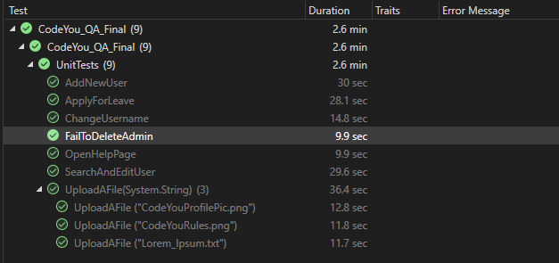

# CodeYou_QA_Final

This is a collection of QA automation methods written for https://opensource-demo.orangehrmlive.com/

This project serves as the final project for Code Louisville's QA course. View the project requirements [here](Files/CodeYouFinal.txt).

Note: The "SelectElement" requirement was not completed, because the provided site doesn't have any elements with the "select" tagname.

